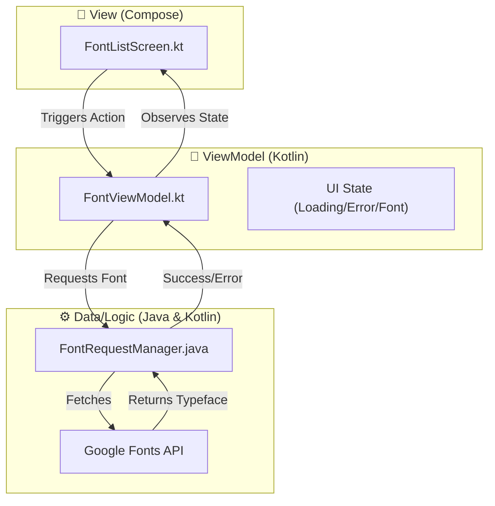
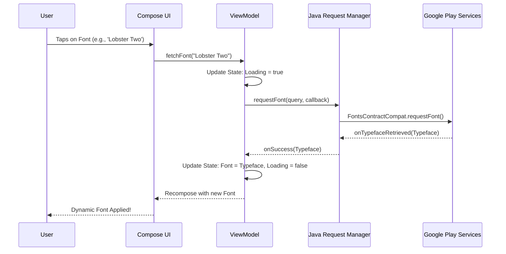

# 🎨 Downloadable Fonts Showcase: An Android Education Journey

  
  
  
  

---

## 🌟 Overview

Welcome to the **Downloadable Fonts Showcase**! This project was born out of a desire to master modern Android development. It's a deep dive into dynamic resource management, architectural patterns, and the beautiful synergy between **Kotlin** and **Java**.

The goal? To create a seamless, high-performance font browser that fetches assets on-demand from the **Google Fonts** provider, keeping the APK light and the typography heavy!

---

## 🚀 Key Learning Objectives

- ✅ **MVVM Mastery**: Implementing a robust separation of concerns.
- ✅ **Interoperability**: Harmonizing Kotlin's expressiveness with Java's legacy power.
- ✅ **Dynamic UI**: Crafting reactive interfaces with **Jetpack Compose**.
- ✅ **Remote Assets**: Implementing the Downloadable Fonts API for on-the-fly customization.

---

## 🏗 Architecture & Flow

### 🧱 MVVM Pattern

### 🌊 Data Flow Chart

---

## 📊 MAD Score (Modern Android Development)

| Category | Component | Experience Gained |
| :--- | :--- | :--- |
| **Language** | Kotlin (90%) / Java (10%) | High interoperability skills |
| **Architecture** | ViewModels, State Management | Clean code principles |
| **UI** | Jetpack Compose, Material3 | Declarative UI design |
| **Jetpack** | Core, Lifecycle, Compose | Modern library utilization |

---

## 📸 Visual Showcase

---

## 🛠 Tech Stack & Tools

- **UI**: Jetpack Compose (Material3)
- **ViewModel**: `androidx.lifecycle:lifecycle-viewmodel-compose`
- **Fonts**: `androidx.compose.ui:ui-text-google-fonts`
- **Logic**: Java's `FontsContractCompat` for legacy integration.
- **Dependency Management**: Gradle Version Catalog (.toml)
- **Networking**: Handled internally by Google Play Services.

---

## 🌈 Coloring & Theming

The project uses a sophisticated **Material3** color scheme, ensuring accessibility and a modern "look and feel."

- 🎨 **Primary Container**: Soft blues for header clarity.
- 🎨 **Surface Variant**: Distinctive cards for font preview.
- 🎨 **Animations**: Smooth state transitions between loading and success.

---

## 🚶‍♂️ Future Roadmap

- [ ] Add Search functionality for 1000+ Google Fonts.
- [ ] Implement local font caching for offline use.
- [ ] Support Variable Fonts (weight/slant sliders).
- [ ] Dark Mode optimization.

---

